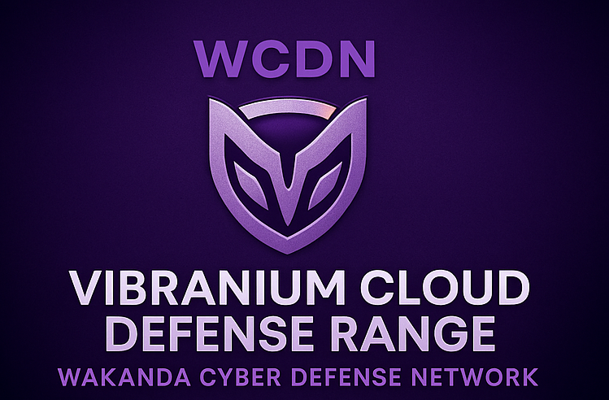

# 🛡️ WCDN – Vibranium Cloud Defense Range
### Cloud Governance • Compliance • Security Posture Assessment

---

## 🔍 Project Overview
The **Vibranium Cloud Defense Range** is a governance-driven cloud security assessment based on industry frameworks (SOC 2, CIS, NIST).  
It evaluates IAM hygiene, monitoring visibility, risk maturity, and cloud compliance readiness across an enterprise environment.

---

## 🧠 Skills Demonstrated
- Cloud Governance & Compliance  
- Risk Assessment & Maturity Scoring  
- IAM Evaluation  
- Logging & Visibility Gap Analysis  
- Policy & Process Review  
- SOC 2 & NIST Alignment  

---

## 🛠️ Tools & Technologies
**AWS IAM, CloudTrail, Config, Security Hub, Governance Frameworks**

---

# 📸 Screenshots
(If applicable — this repo may not require screenshots.)

---

# 📘 Documentation
- `documentation/methodology.md`  
- `documentation/findings.md`  
- `reports/executive-summary.pdf`

---

# 🧩 Lessons Learned
- Governance maturity requires continuous iteration  
- Monitoring visibility influences detection success  
- IAM hygiene is a foundation of cloud security  
- Risk posture improves with structured documentation  

---

# ⚖️ Ethical Notice
Assessment performed using synthetic organizational data and non-production cloud resources.

---

# 🏁 Summary
This project showcases your ability to perform a structured cloud governance assessment and deliver actionable compliance recommendations.
